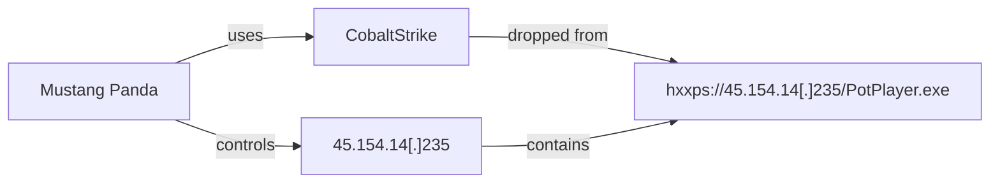
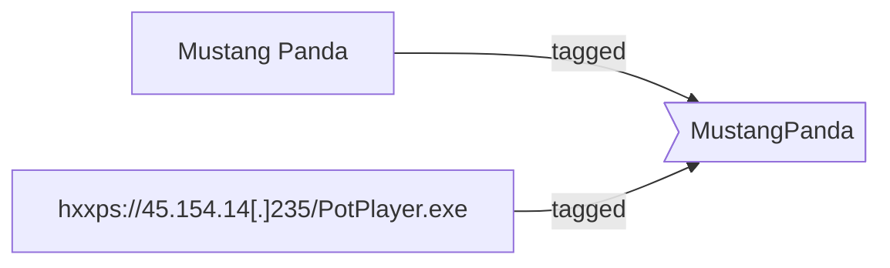
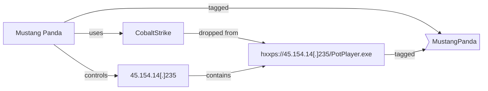

This page dives into key concepts of Yeti

## Objects

The Yeti data model consists of different objects, which can be split into three
categories:

- **Observables**: technical elements such as URLs, IP addresses, hostnames,
  user-agents, common strings, etc.
- **Entities**: tactical elements such as campaigns, threat actors, malware,
  etc.
- **Indicators**: these are high-level elements that can be used to "match"
  observables and associated them to entities.

## Links

Any object in Yeti can be linked to any other through the API. You can link a
malware object to a URL and a threat actor. For example:



- `Mustang Panda` is an `Entity` of type `Actor`,
- `CobaltStrike` is an `Entity` of type `Malware`,
- `hxxps://45.154.14[.]235/PotPlayer.exe` is an `Observable` of type `URL`,
- and `45.154.14[.]235` is an `Observable` of type `IP`.

This graph is what we call the "Threat graph". The model is designed to be
flexible, so how you decide to link things is up to you. However, we recommend
to link Entities to Observables through _Tags_.

## Tags

A lot of things in Yeti revolve around tags. Tags can be applied to any
Observable or Entity. Any object that is tagged with the same tag will be linked
through the "Tag Graph". It's an easy way to build your relationship graph from
the UI.

Going from the example above alone, the link between `Mustang Panda` and
`hxxps://45.154.14[.]235/PotPlayer.exe` is not obvious. However, if we tag
`hxxps://45.154.14[.]235/PotPlayer.exe` and `MustangPanda` with `MustangPanda`,
a link will be created in the database:



Our graph now looks like this:



## Indicators

We mentioned `Indicators` as a third category of objects. `Indicators` are
high-level objects that can be used to "match" observables and apply tags to
them. They are linked to other entities through the Threat Graph.

For example, you could create an `Indicator` of type `regex` called
`MustangPanda CobaltStrike URL`, with the pattern `[0-9]{1,3}/PotPlayer.exe$`

```json
{
  "name": "MustangPanda CobaltStrike URL",
  "type": "regex",
  "pattern": "[0-9]{1,3}/PotPlayer.exe$",
  "relevant_tags": ["loader", "mustangpanda"]
}
```

Once an observable gets submitted through Yeti's match function (the homepage),
the tags in `relevant_tags` will be suggested for the analyst to apply. This
will _not_ create a link between the Indicator and the Observable, but if you
played your cards (or tags) right, and the `relevant_tag` is the same as an
Entity's `relevant_tags`, then the Observable will be linked to the Entity
through the Tag Graph.

### Power in automation

However, it's more likely that observable matching will happen through
automation. The web UI can only match text-based observables that you submit
through it (which means only `Regex` and `Yara` indicators would work here).
Other indicators, like `Query` or `Sigma`, are meant to be used through
automation with other systems.

In automation, possibilities open up. You can use `Query` indicators on e.g. a
Timesketch sketch, extract observables from matching events, add them to Yeti
and tag them with the indicator's `relevant_tags`, or the associated entitie's
`relevant_tags`. You can also tag Timesketch events in the same way.

## Tasks

Yeti thrives on automation. The API provides powerful functions to navigate
through the graph, tag objects, create links between them, etc., and much of
that is lost when doing things through the UI.

The potential for automation is fully unlocked by Yeti's `Tasks`. Tasks are
Python scripts that can be run on a schedule, or on-demand. Tasks are split into
three categories, described below.

### Analytics

Analytics are Python scripts that are laoded by Yeti at start. These typically
take an observable as input, and either enrich it or extracts new observables
from it. For example, the `process_url.py` analytics will extract IP addresses
or Hostnames from URL Observables. The `virustotal_api.py` analytics will enrich
observables with VirusTotal data, _and_ add any related observables Yeti's
database.

The power of Yeti comes when you create your own private analytics that can be
plugged into the system very easily.

### Feeds

Feeds are also Python scripts that are loaded at system start. They are exactly
what you expect them to. They regularly check external sources of information
and incorporate observables they find to the database.

You can also easily add your own Feeds to Yeti by adding a simple Python script
to the directory structure.

### Exports

Exports are meant to select a subset of observables depending on your criteria
(tags to include, to exclude, to ignore), and render them to disk through a
Jinja template. The reason this is not done in real-time is that it can be a
quite resource-intensive operation for larger datasets.

In terms of code, Exports are a bit different: unlike Feeds or Analytics, they
don't contain that much unique logic, and so it's possible to just create new
ones from the UI.

### Custom automation

Of course, nothing stops you from creating a feed that will also enrich existing
observables, or an analytics that pulls down external data used for processing.
