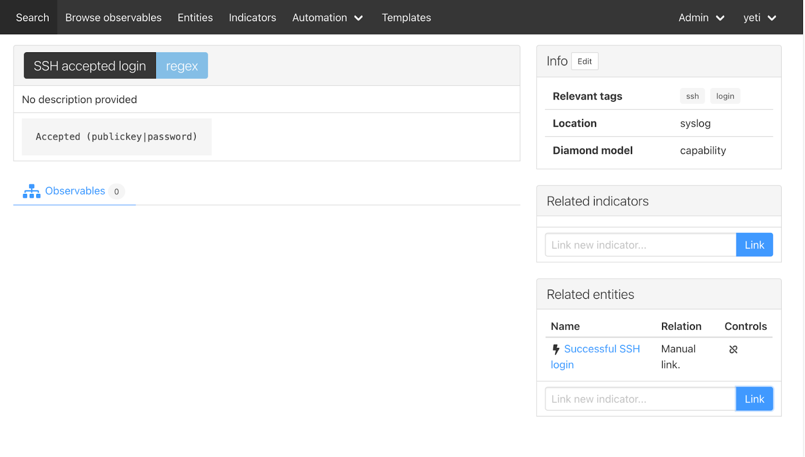
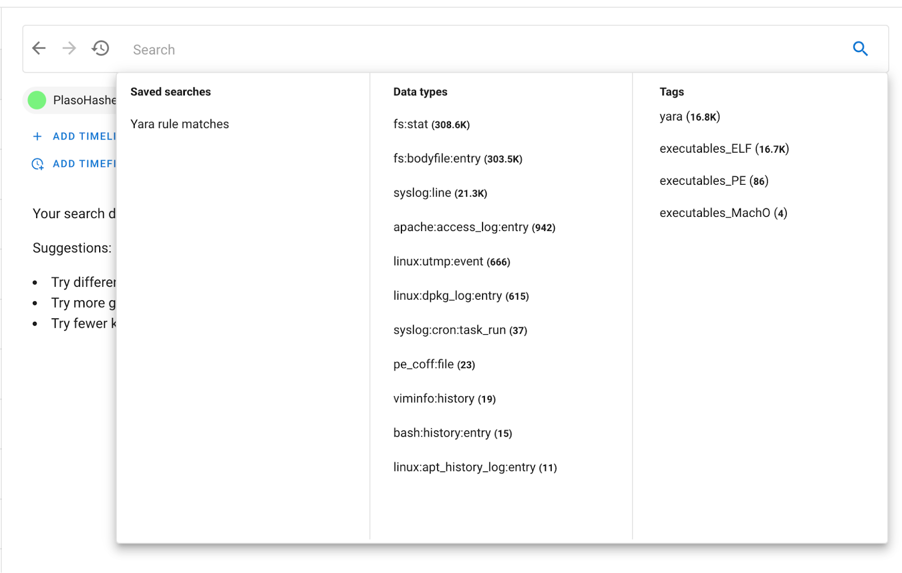
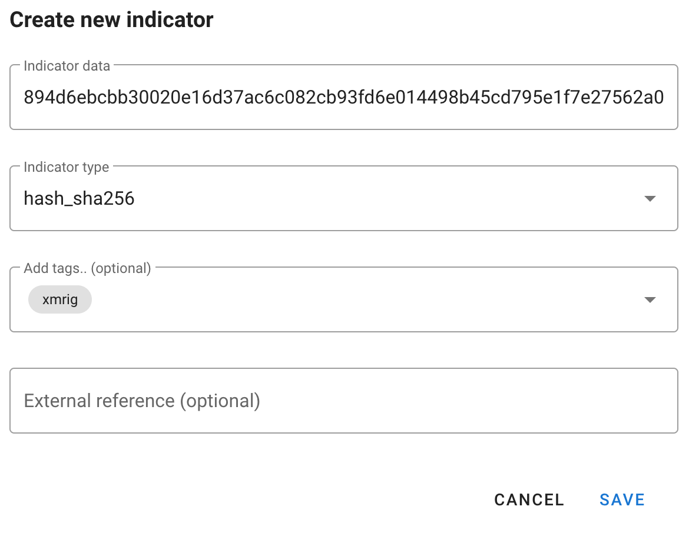
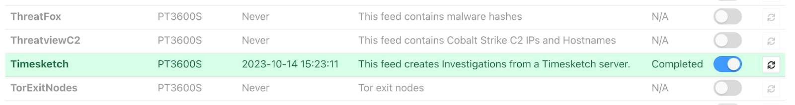
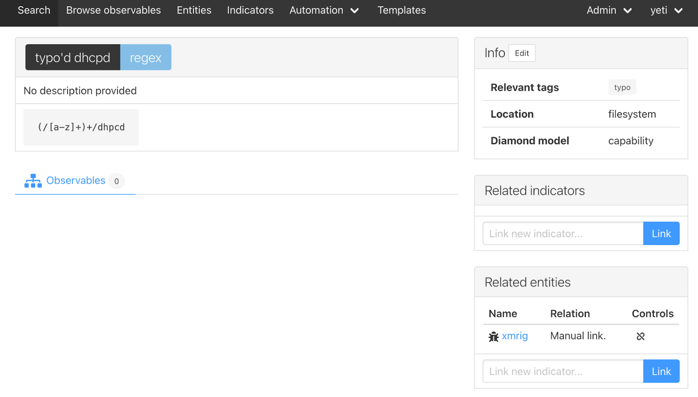
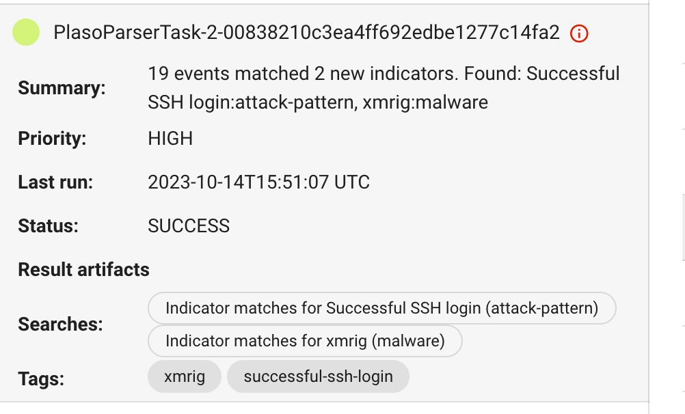

# First steps

Make sure you've followed the
[infrastructure setup guide](/guides/hacklu-2023/infrastructure_setup) before
following up with this page.

## Upload evidence to Timesketch

Plaso files can be found
[here](https://drive.google.com/drive/folders/1AA8mOkUOOxQj-IjbvN9MPNzCA4CJRkT4).

- Head to [http://localhost:5000/](http://localhost:5000/), sign in with
  `dev/dev`
- Click on "Blank Sketch", and give it an appropriate name (e.g. `YetiGuide`)
- Click on "Add Timeline", and select the one of the plaso files you downloaded.
  - The file will upload and you will be sent to the "Sketch view"


- Continue adding all the other plaso files by clicking on "Add Timeline", and
  repeating the process above
- Once you see something like this, you're on good track!


**It will take a few minutes for the timelines to process, depending on how
powerful your workstation is.** Now's a great time to take a break, or follow
along with the instructions for Yeti below.

## Adding some intel to Yeti

Before we jump into the analysis of our timelines, it's a good idea to add some
intel first to Yeti to get you started. We're going to document what a
successful SSH login looks like in our logs.

### Add a "SSH login" attack pattern

Head to [http://localhost:80/](http://localhost:80/) and click on Log in (no
credentials needed). Then head to "**Entities**", and on the right-side panel
click "**New entity**". From the dropdown menu, select "**Attack pattern**".

- Name: `Successful SSH login`
- Relevant tags: `login` (these will be generated as tags as soon as you hit
  comma)
- Description: Optional.

Click "save". Congrats, you've added your first attack pattern to Yeti! You
should see it pop up on the right side.

### Add an indicator for the SSH login attack pattern

Now head over to "Indicators" in the menu bar. We're going to add a "**regular
expression**" that captures what we're looking for. Like previously, head to
"**new indicator**"

Pick "**Regular expression**" from the dropdown, and fill it in as follows:

- Name: `SSH accepted login`
- Pattern: `Accepted (publickey|password)`
- Relevant tags: `ssh`, `login`
- Location: `syslog`
- Diamond model: `capability`
- Description: Optional

Click "save". Now, time to link the indicator to our attack pattern!

Click on your freshly added indicator, and on the right hand side of the page,
search for "SSH" in "Related entities", and click "Link". You should have
something like this:



## Analyzing the evidence

**Some context**: as in every forensic investigation, context is critical. What
are these files you've been given to analyze? What are you even looking for?
**In this case, we've been given some evidence coming from a GCP VirtualMachine
on which our detection systems have seen abnormal CPU usage.**

Head back to Timesketch
([http://localhost:5000/sketch/1/explore](http://localhost:5000/sketch/1/explore))
and start browsing the data you have. What do you notice? What are the three
timelines we've collected? Hint: look at the `data_type` field in the events
from each timeline.

## Running the Tagger analyzer

In the search bar, type `_exists_:yara_match`. You'll see a list of events
appear, all coming from the same timeline (why?). Open one of them, and look for
the attribute `yara_match`.

Note: these plaso files were generated by plaso, and given a set of Yara rules
to match files against. The `yara_match` attribute contains a list of yara rules
that matched the file. In this case, we've used a series of "classification"
Yara rules, that will just give us an idea of what kind of file we're looking
at. This will come in handy later on.

It's very annoying to have to open the event attributes every time we want to
know what kind of file this is, and it makes searching for them quite annoying.
Fortunately, there is a simple Timesketch analyzer that can extract these fields
and tag events with its contents.

Click on the "+" next to "**Analyzer results**" on the left hand side of the
page. In the search bar, select the PlasoHasherTask timeline (you can select
other timelines as well, but they don't have that field set, so running the
analyzer on those will have no effect and will unnecessarily consume resources).

**Search for the "Tagger" analyzer**, and click on the Play button next to it.
The analyzer takes a few seconds to run, and you'll see "**Analyzer results
(1)**" on the left hand side of the screen. Click through Analyzer results →
Tagger → PlasoHasherTask to see all results:


Almost 17k events tagged in just a few seconds. Head back to "Search" (top left)
and click on the search bar. A popup will appear:



You have a helpful aggregation of tags on the right. Where there were none
before, now we have some! 16.7k of the files that were tagged are ELFs, with
some others also tagged PE and MachO. You can now see the tags directly in the
event list:


This can come in very handy if you want to, for example, look at the latest ELF
files that were created on that disk. (this would yield interesting results for
this investigation)

## Running the Yeti analyzer

Repeat the process for running analyzers, but this time select all available
timelines. Head down to the "Yeti CTI indicators" analyzer and click the Play
button. After a few seconds, you should see this:


The main search bar also has new additions:


You can click on the "Indicator matches for Successful SSH login" or the
"successful-ssh-login" tag to filter out events highlighted by Yeti. Or, search
for `tag:"successful-ssh-login"` in the search bar.

## Finding the intrusion vector

What stands out of these SSH logins? Play around with timesketch to figure out
what happened around the time of each connection. Are they legitimate?

## Finding the malware

Start by pivoting on the time the SSH connection happens, and clear the search
to look at events. What previous sketch automation can we leverage to find
interesting things (maybe the `executables_ELF` tag is interesting?)

## Annotating intelligence

How do we keep track of intelligence we've been finding in Timesketch? Look at
the "Threat intelligence" section on the left. You'll see it already has one
item, which was added by our first Yeti analyzer run. It's not super relevant,
but you'll see where we're going with this.

So far you have:

- The hash of the malware
- It's location in the filesystem
- The IP used for logging into the system

Let's add all of these to the intelligence section of timesketch. Click the +
button, and add away.



You can click on the pencil icon to go to a "wider" view of intelligence on the
sketch:


Here you can curate, edit, remove any items you deem unnecessary or unworthy of
being exported. You can also click on the magnifying glass on the left to see
all other events that match those IOCs.

As an investigator, this kind of work is good because then CTI teams can
capitalize on this and disseminate that intelligence to other teams (or future
you when you run into a similar case again)

## Importing intelligence into Yeti

Head to Yeti, then "Automation" in the menubar, then "Feeds". Scroll down to
where you can see the Timesketch feed, enable it, and click on the refresh icon
to run it. After a few seconds, it should look like this:



Head to the Entities menu, and you'll see a brand new Investigation appear in
there. Click on it, and you'll see some information imported from Timesketch:


You'll note that the "Accepted password" indicator that we collected doesn't
show up here - it's because Yeti doesn't know what kind of observable it is.

Your reverse engineering of the sample, as well as the tags provided by the
forensic analyst, tells you that this is xmrig, a common cryptominer. Time to
document this.

**Create a new entity of type Malware:**

- Name: xmrig
- Relevant tags: xmrig
- Family: cryptominer

You also want to document the dropped filename (notice the typo for dhcpd) as
you think it can be a quick win for analysts that may run into similarly
compromised systems.

**Add an indicator of type regex:**

- name: typo'd dhcpd
- pattern: `(/[a-z]+)+/dhpcd`
- relevant tags: typo
- Diamond model: capability

Save it, and link it to the xmrig malware. You should have something like this:



Try it out! Re-run the Timesketch Yeti analyzer, and see if it produced any new
tags on your sketch.



Click on the xmrig tag, or go through the saved search, and you'll find many
other goodies such as cronjobs that are related to your investigation. You'll
see that the intelligence page has been populated with new findings (mostly the
filesystem paths to the weird dhpcd binary)

Finally, now that you have some good documentation, imagine you're someone who
comes across this weird dhpcd binary, and you want to know if it's been seen
before. Head to the Yeti Search page, and paste your path in the search box:


## Getting more evidence

This will make you use GRR and dfTimewolf. Please follow the instructions in the
[infrastructure setup guide](/guides/hacklu-2023/infrastructure_setup) to get a
GRR server up and running on your workstation (also using Docker).

### First steps with dfTimewolf

If you followed the instructions above and in , you **create a dfTimewolf config
file** similar to this one in your home directory:

```{filename="~/.dftimewolfrc"}
{
    "grr_server_url": "http://grr-server:8000",
    "grr_username": "admin",
    "grr_password": "demo",
    "endpoint": "http://timesketch-dev:5000",
    "username": "dev",
    "password": "dev"
}
```

### Run dfTimewolf

These commands will automatically pull the image from
[https://registry.hub.docker.com/r/tomchop/dftimewolf](https://registry.hub.docker.com/r/tomchop/dftimewolf)

To collect the `BrowsingHistory` artifact from your host (you probably won't
find anything), but have a look at
[https://github.com/ForensicArtifacts/artifacts/tree/main/data](https://github.com/ForensicArtifacts/artifacts/tree/main/data)
to see what makes sense to pull

Alternatively, you can also upload a file system timeline of the docker host to
Timesketch:

## Some tips in case you get stuck (spoilers ahead!)

### Analysis of plaso files

#### Identify Initial access vector

- SSH bruteforce
- Query: reporter:sshd AND accepted
- First IP is benign (init7 switzerland)
- Second doesn't do anything
- Third drops stuff

#### Pivot on time

- Add time filter (e.g. 2023-10-02T04:50:48)
- Clear search

OR

- Context search, replace search

See that a lof of filesystem accesses happen (execution) Remove them?

- Open event
- Timestamp Desc "Last Access Time"
- Click on remove from filter
- Scroll down until we see
  - EXT:/usr/bin/dhpcd → that's our coinminer (it's on VT)

https://www.virustotal.com/gui/file/894d6ebcbb30020e16d37ac6c082cb93fd6e014498b45cd795e1f7e27562a09c

#### Document findings in Yeti

**Malware**

Yeti → Entities → New entity

Entity type: malware

Name: xmrig

Relevant tags: xmrig

Family: whatever (miner)

Aliases: whatever

Description: whatever

**Indicator**

Yeti → Indicators → New indicator

Type: regex

Name, location, diamond, description, whatever

Important: pattern dhpcd

Related entities:

Add xmrig

Exercise. Go to "Search" and type in the full path

See search results → dhcpd typo

### Leveraging Yeti from Timesketch

Run Yeti analyzer, look at all the tagged events, star the ones we think are
interesting.
