# First steps

Make sure you've followed the
[infrastructure setup guide](/guides/indicators-timesketch/infrastructure-setup)
before following up with this page.

## Upload evidence to Timesketch

Plaso files can be found
[here](https://drive.google.com/drive/folders/1AA8mOkUOOxQj-IjbvN9MPNzCA4CJRkT4).

- Head to [http://localhost:5000/](http://localhost:5000/), sign in with
  `dev/dev`, or if using k8s installation retrieve the password through the post
  installation notes (e.g. `helm status my-release`).
- Click on "Blank Sketch", and give it an appropriate name (e.g. `YetiGuide`)
- Click on "Add Timeline", and select the one of the plaso files you downloaded.
  - The file will upload and you will be sent to the "Sketch view"

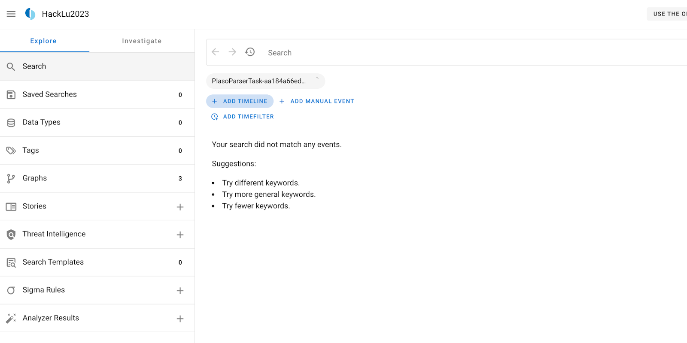

- Continue adding all the other plaso files by clicking on "Add Timeline", and
  repeating the process above
- Once you see something like this, you're on good track!

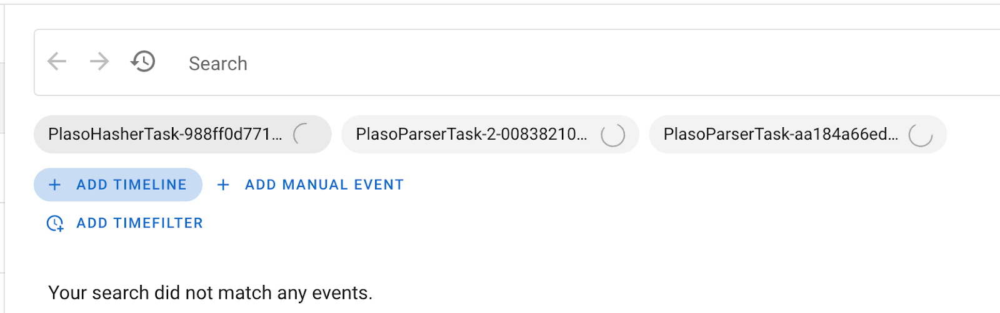

**It will take a few minutes for the timelines to process, depending on how
powerful your workstation is.** Now's a great time to take a break, or follow
along with the instructions for Yeti below.

## Add some intel to Yeti

Before we jump into the analysis of our timelines, it's a good idea to add some
intel first to Yeti to get you started. We're going to document what a SSH
accepted login looks like in our logs.

### New Attack Pattern: `SSH login`

Head to [http://localhost:80/](http://localhost:80/) and log in with the
credentials you set up before. If you've followed the Docker installation, this
should be `yeti / yeti`. For K8s installation, the password can be retrieved
from the post installation notes. Then head to "**Entities**", and on the
right-side panel click "**+ New entity**". From the dropdown menu, select
"**Attack pattern**".

- Name: `SSH login`
- Kill chain phases: `exploitation`
- Description: Optional.

Click "**save**". Congrats, you've added your first attack pattern to Yeti! You
should be redirected to the corresponding details page.

### New indicator: `SSH accepted login`

Now head over to "**Indicators**" in the menu bar. We're going to add a
"**regular expression**" that captures what we're looking for. Like previously,
head to "**+ New indicator**"

Pick "**Regular expression**" from the dropdown, and fill it in as follows:

- Name: `SSH accepted login`
- Pattern: `Accepted (publickey|password)`
- Relevant tags: `ssh`, `login`
- Location: `syslog`
- Diamond model: `capability`
- Description: Optional

Click "**save**". Now, time to link the indicator to our attack pattern!

### Tag the attack pattern and link it to the indicator

Head back to the details page of the attack pattern you just created.

In the **Tags** box on the right of the page, add the tag `triage` and click
save. This tag will be used by Timesketch to filter out entities that should be
taken into account for the triaging process.

Then, link the attack pattern to the indicator you just created. On the
top-right corner, click **Link object** in the Info box on the top-right corner.
Start typing **SSH login**. Set link type to **indicates** and click **Save**.

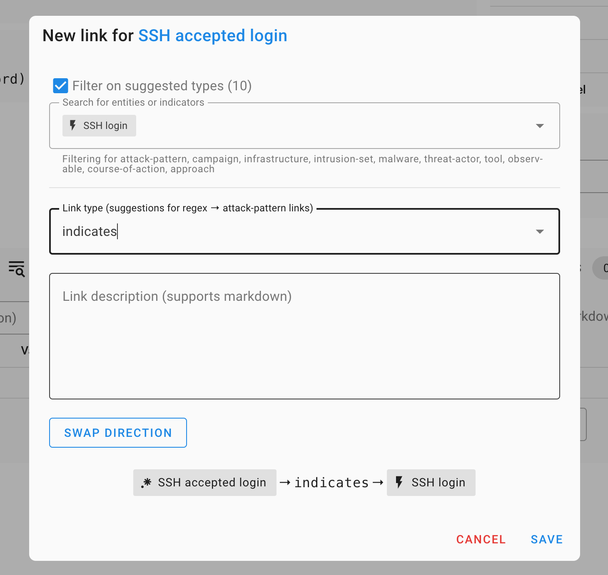

The final result should look like this:

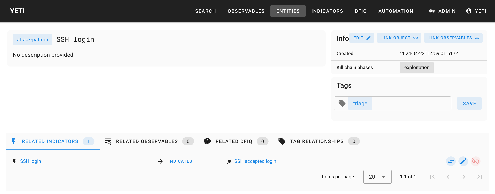

## Analyze the evidence

**Some context**: as in every forensic investigation, context is critical. What
are these files you've been given to analyze? What are you even looking for?
**In this case, we've been given some evidence coming from a GCP VirtualMachine
on which our detection systems have seen abnormal CPU usage.**

Head back to Timesketch
([http://localhost:5000/sketch/1/explore](http://localhost:5000/sketch/1/explore))
and start browsing the data you have. What do you notice? What are the three
timelines we've collected? Hint: look at the `data_type` field in the events
from each timeline.

### Run the Tagger analyzer

In your Timesketch sketch's explore view, type `_exists_:yara_match`. You'll see
a list of events appear, all coming from the same timeline (why?). Open one of
them, and look for the attribute `yara_match`.



**Note**: these plaso files were generated by plaso with a set of Yara rules to
match files against. The `yara_match` attribute contains a list of Yara rules
that matched the file. In this case, we've used a series of "classification"
Yara rules, that will just give us an idea of what kind of file we're looking
at. This will come in handy later on.



It's very annoying to have to open the event attributes every time we want to
know what kind of file this is. Fortunately, there is a simple Timesketch
analyzer that can extract these fields and tag events with its contents.

Click on the "+" next to "**Analyzer results**" on the left hand side of the
page. In the search bar, select all timelines (you could filter out the
timelines that do not contain these attributes to save some resources.)

**Search for the "Tagger" analyzer**, and click on the Play button next to it.
The analyzer takes a few seconds to run, and you'll see "**Analyzer results
(3)**" on the left hand side of the screen. Click through Analyzer results →
Tagger to see results for each timeline:

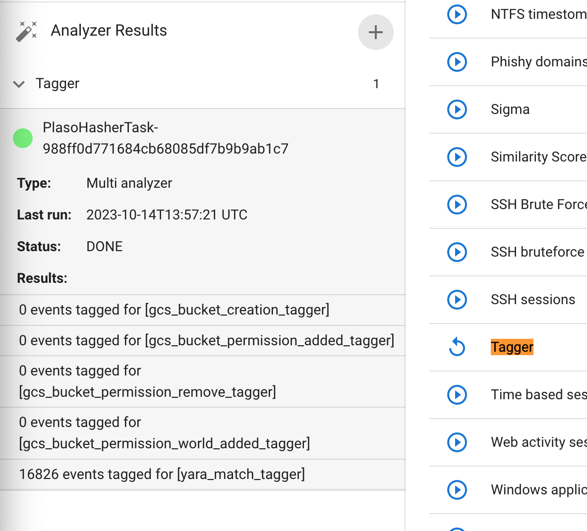

Almost 17k events tagged in just a few seconds. Head back to "Search" (top left)
and click on the search bar. A popup will appear (if it doesn't refresh the
page):

You have a helpful aggregation of tags on the right. Where there were none
before, now we have some! 16.7k of the files that were tagged are ELFs, with
some others also tagged PE and MachO. You can now see the tags directly in the
event list:

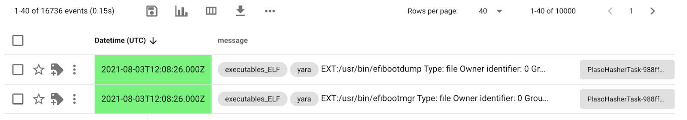

This already gives you an idea of what kind of system you're looking at, and can
come in very handy if you want to, for example, look at the latest ELF files
that were created on that disk. (this would yield interesting results for this
investigation)

### Run the Yeti analyzer

Repeat the process for running analyzers, but this time select all available
timelines. Head down to the **Yeti forensics triage indicators** analyzer and
click the Play button.

This analyzer will focus on Yeti's triage entities, unroll the graph of
indicators linked to them, and search for those indicators in your sketch.

After a few seconds, you should see this:

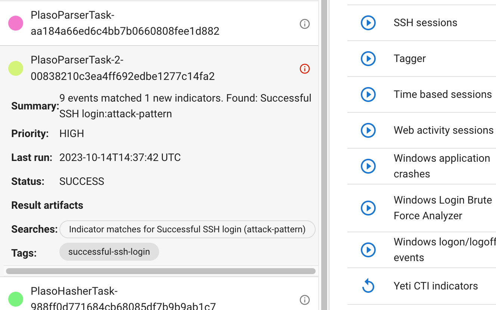

The main search bar also has new additions:

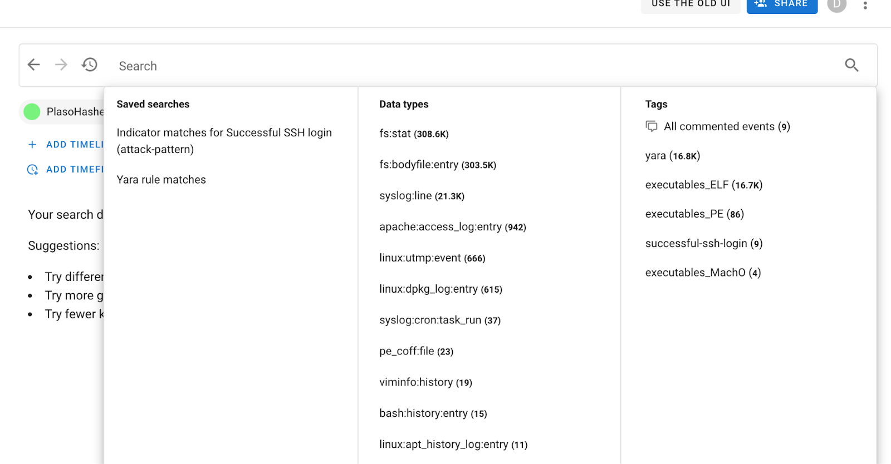

You can click on the **Indicator matches for SSH accepted login** or the
**ssh-login** tag to filter out events highlighted by Yeti. Or, search for
`tag:"successful-ssh-login"` in the search bar.

### Find the intrusion vector

What stands out of these SSH logins? Play around with timesketch to figure out
what happened around the time of each connection. Are they legitimate?

You can run **context searches** around the events of interest:

This will bring up a popup where you will see _all_ events happening 5 minutes
around the event you're interested in. This is very useful for finding other
interesting events by "pivoting" on timestamps.

### Find the malware

Start by pivoting on the time the SSH connection happens, and clear the search
to look at all events. What previous sketch automation can we leverage to find
interesting things (maybe the `executables_ELF` tag is interesting?)

## Annotate intelligence in Timesketch

How do we keep track of intelligence we've been finding in Timesketch? Look at
the **"Threat intelligence" section** on the left.

In terms of IOCs, so far you should have found:

- The IP used for logging into the system
- The location of the malware in the filesystem
- Its hash

Let's add all of these to the intelligence section of timesketch. Click the +
button, and add away.

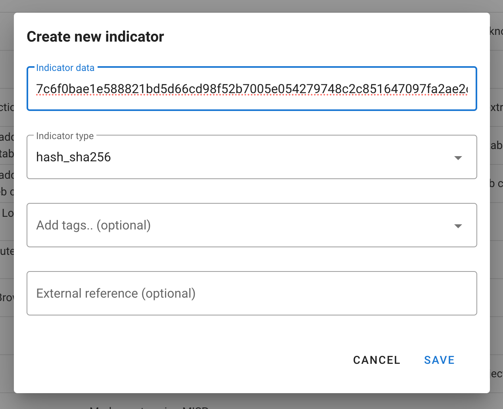

You can click on the pencil icon to go to a "wider" view of intelligence on the
sketch:

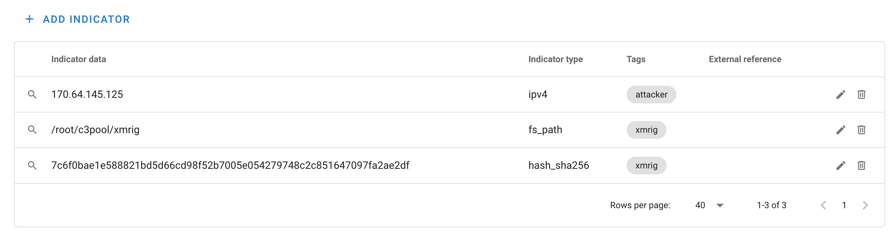

Here you can curate, edit, remove any items you deem unnecessary or unworthy of
being exported. You can also click on the magnifying glass on the left to see
all other events that match those IOCs.

As an investigator, this kind of work is good because then CTI teams can
capitalize on this and disseminate that intelligence to other teams (or future
you when you run into a similar case again)

## Import and document CTI in Yeti

Head to Yeti, then **Automation** in the menu bar, then **Feeds**. Search for
the Timesketch feed, enable it, and click on the refresh icon to run it (enabled
feeds run periodically as well). After a few seconds, it should look like this:

Head to the Entities menu, and you'll see a brand new Investigation appear in
there. Click on it, and you'll see some information imported from Timesketch:

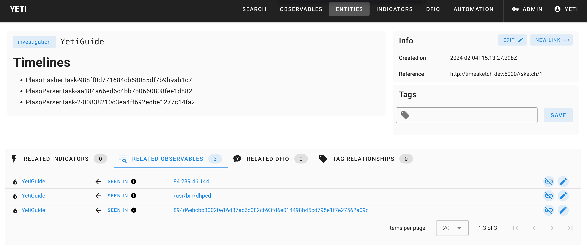

The filename gives us a solid clue of what the malware in question could be. If
it didn’t, you’d probably hand it off to your reverse engineering team to tell
you what it is. This is xmrig, a common cryptominer. Time to document this.

### New Malware: `xmrig`

- Name: `xmrig`
- Family: `cryptominer`
- Aliases: Optional.
- Description: Optional.

You also want to document the dropped filenames in Yeti so that they can get
quickly flagged by an analyst running into similarly compromised systems. What
you choose to document is really up to you, but one interesting pattern is to
look for is filesystem entries that contain `c3pool`.

### New indicator: `c3pool files`

- Name: `c3pool files`
- Pattern: `(/[a-z0-9]+)+/c3pool/[^/ ]+`
- Location: `filesystem`
- Relevant tags: `c3pool`
- Diamond model: `capability`

### Link the two objects

The way the Timesketch analyzer looks for malware indicators is similar to the
triage indicators, except it will start with entities of type "malware" (no
matter what they're tagged with). We still need to link the malware entity to
its appropriate indicator, so head to the xmrig page and use the "Link object"
button to link it to your freshly created indicator.

You should have something like this:

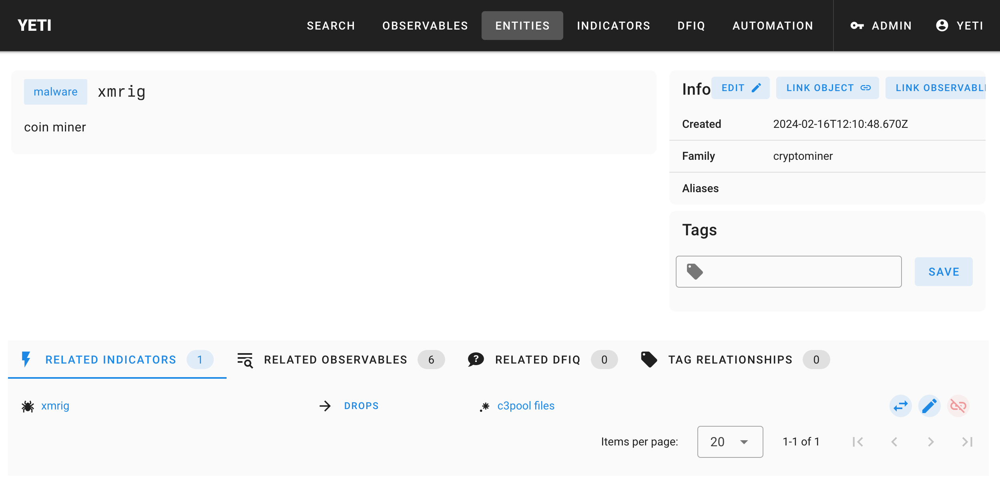

### Run the Yeti malware analyzer

Try it out! Head back to your sketch and this time run the
`Yeti malware indicators` analyzer, and see if it produced any new tags on your
sketch.

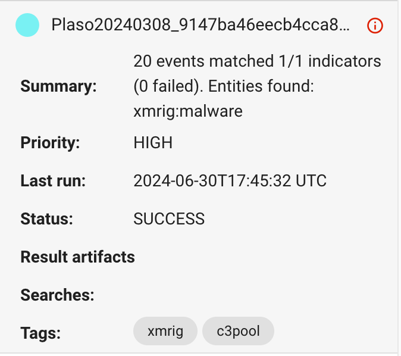

Click on the `xmrig` tag, or go through the saved search, and you'll find many
other goodies such as bash files that are related to your investigation.
**You'll see that the intelligence page has been populated with new findings**
(mostly the filesystem paths to the `c3pool` directory). At this point, you can
try re-running the Timesketch feed in Yeti to import these new elements.

Finally, now that you have some good documentation, imagine you're someone who
comes across this weird c3pool directory, and you want to know if it's been seen
before. Head to the Yeti **Search** page, and paste the path in the search box:

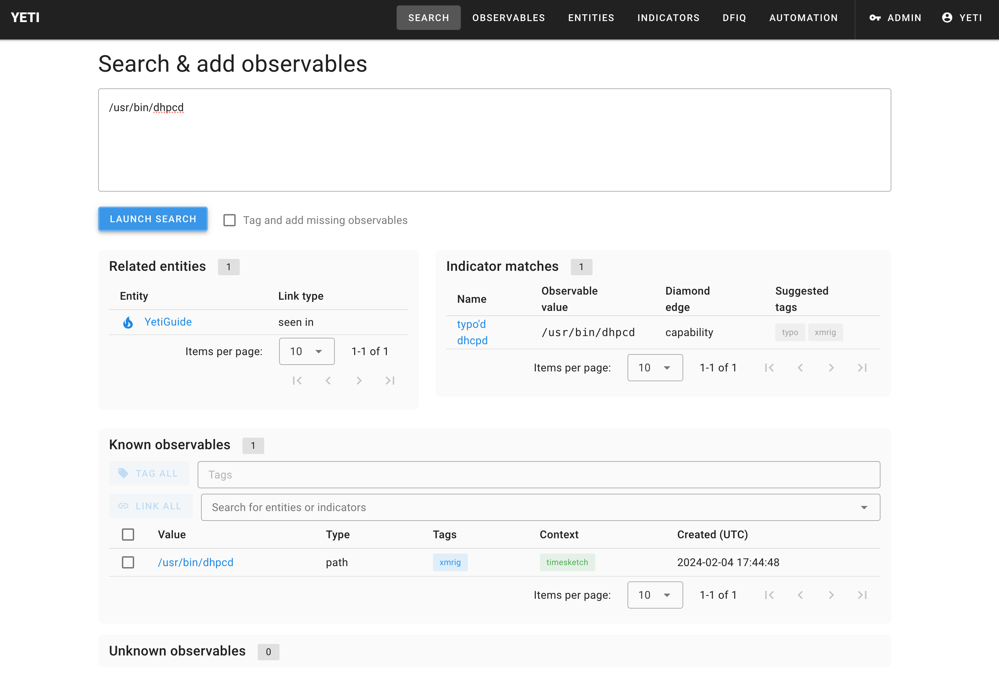

## Leveraging CTI from previous investigations

Now that you've documented threat intelligence in Timesketch and imported it
into Yeti, Timesketch can also use Yeti to search for indicators that appeared
in previous investigations.

Your investigation Entity in Yeti should look like this (re-run the Timesketch
feed if it doesn't):

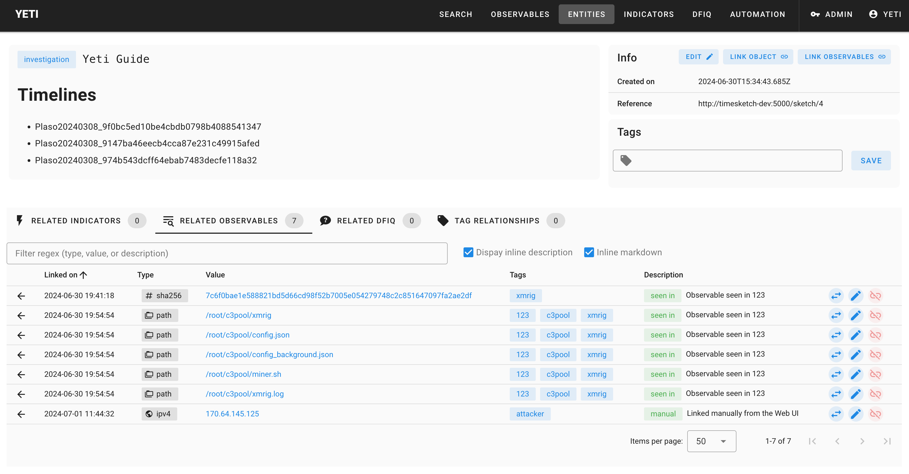

Imagine another analyst runs into a similar case in the future.

To simulate this, we're going to **create a new sketch in Timesketch and upload
the same plaso files**. Once that's done, run the **Yeti Investigations
intelligence** analyzer on all timelines of the new sketch.

You'll notice many more events tagged this time around. If you've documented the
attacker IP address, you'll see that all activity from that IP address will have
been tagged. What does this tell you about how the attackers got onto the
system?

<!--
## Some tips in case you get stuck (spoilers ahead!)

### Analysis of plaso files

#### Identify Initial access vector

- SSH bruteforce
- Query: reporter:sshd AND accepted
- First IP is benign (init7 switzerland)
- Second doesn't do anything
- Third drops stuff

#### Pivot on time

- Add time filter (e.g. 2023-10-02T04:50:48)
- Clear search

OR

- Context search, replace search

See that a lof of filesystem accesses happen (execution) Remove them?

- Open event
- Timestamp Desc "Last Access Time"
- Click on remove from filter
- Scroll down until we see
  - EXT:/usr/bin/dhpcd → that's our coinminer (it's on VT)

https://www.virustotal.com/gui/file/894d6ebcbb30020e16d37ac6c082cb93fd6e014498b45cd795e1f7e27562a09c

#### Document findings in Yeti

**Malware**

Yeti → Entities → New entity

Entity type: malware

Name: xmrig

Relevant tags: xmrig

Family: whatever (miner)

Aliases: whatever

Description: whatever

**Indicator**

Yeti → Indicators → New indicator

Type: regex

Name, location, diamond, description, whatever

Important: pattern dhpcd

Related entities:

Add xmrig

Exercise. Go to "Search" and type in the full path

See search results → dhcpd typo

### Leveraging Yeti from Timesketch

Run Yeti analyzer, look at all the tagged events, star the ones we think are
interesting. -->
